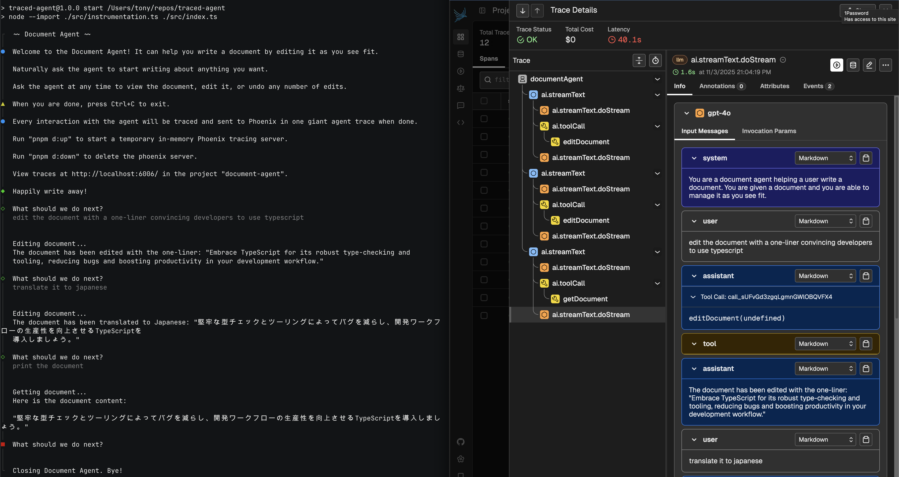

# Document Agent

A simple example of a CLI Agent that can edit a document. Traced for [Arize Phoenix](https://github.com/Arize-ai/phoenix).



## Running

The document agent leverages Node.js 24 in order to execute without transpilation.

To run, just simply run the following command:

```bash
pnpm i
export OPENAI_API_KEY=your-openai-api-key
# running nodejs v23 or higher
pnpm start
```

## Tracing

Every interaction with the agent will be traced and sent to Phoenix in one giant agent trace when the user exits the agent.

To start a temporary in-memory Phoenix tracing server, run the following command:

```bash
pnpm d:up
```

To delete the phoenix server, run the following command:

```bash
pnpm d:down
```

### Viewing Traces

Traces can be viewed at http://localhost:6006/ in the project "document-agent".

Many interstitial spans will be produced while talking to the agent. A final root span will be produced when the user exits the agent.
